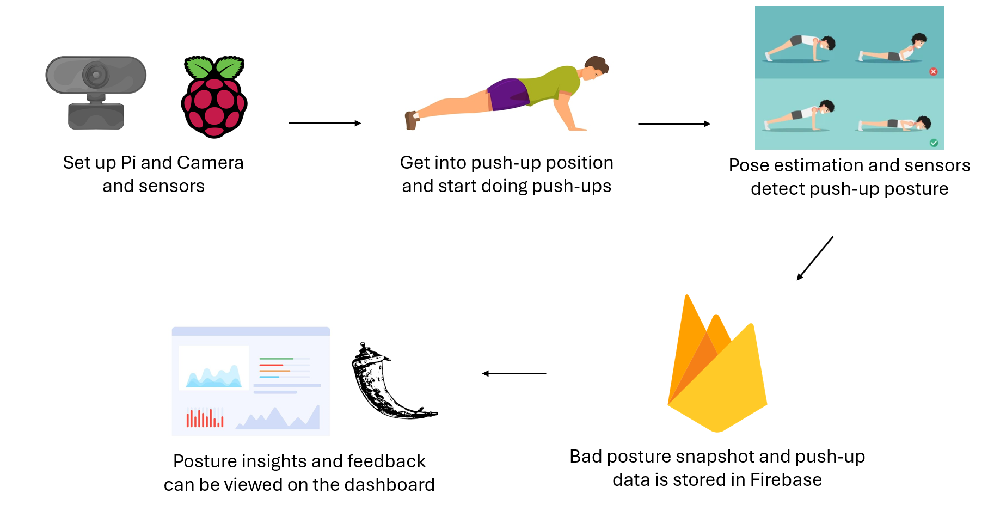
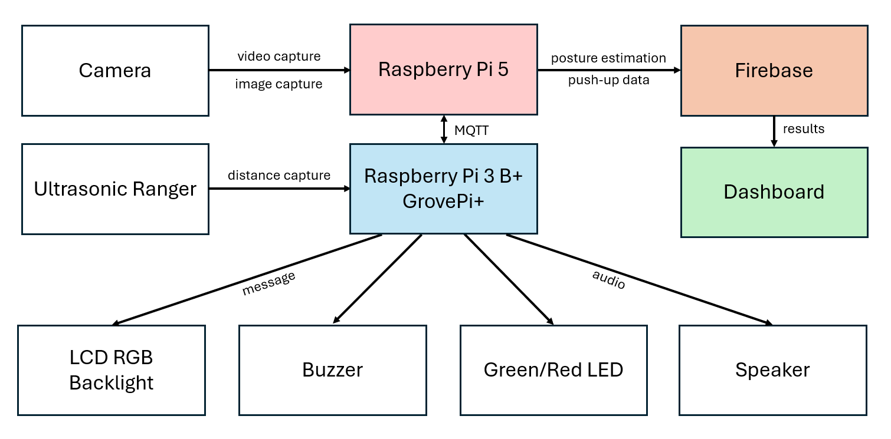

# INF2009_T2 

---

## 🏋️‍♂️ At Home ELISS Push-up Machine
This project showcases an at-home simulation of Singapore's IPPT ELISS Machine, with the goal of allowing NSFs and NSmen to remotely experience the push-up station, and additionally receive feedback on push-up posture.

## ❓ Problem Statement
In many military camps, the ELISS (Electronic IPPT Scoring System) machine is used to measure the quality and count of a person’s push-ups. However, users frequently feedback about the inaccuracy of the machine’s assessments, which may be attributable to the subtle variations in push-up form. These inaccuracies can often lead to frustration and unreliable performance metrics. Given the importance of proper push-up form, there is a need for an at-home solution for NSFs and NSmen to train and get acquainted with how the machine works, providing them with accurate and real-time feedback

## 🧱 Devices / Components
1. Raspberry Pi 3 Model B+
2. Raspberry Pi 5
3. GrovePi+
4. Webcam
5. Cytron - Ultrasonic Ranging Module SR04P
6. Grove - LCD RGB Backlight
7. Grove - Buzzer
8. Grove - Red LED
9. Grove - Green LED
10. Speaker
11. Firebase Database
12. Flask Webpage

## 🛠️ Methodology / Project Timeline / Hardware Justification
The initial idea of the project was thought up in Weeks 2-3 of this trimester.
After consulting, the project was green-lit and we began preparations.

Weeks 4-7 were spent coming up with ideas and sourcing the hardware needed for the project.
We decided to use the *GrovePi+* as it had compatible sensors that were core modules in our push-up system.
Additionally, some of our group members had previously worked with the *GrovePi+*.
We ran basic tests on the hardware and finalised our ideas, resulting in the *At Home ELISS Push-up Machine*, utilising the various sensors aforementioned.

Initial tests with the *GrovePi+* and the pose estimation implementation resulted in poor compatibility issues.
The *GrovePi+* was a discontinued product, with it no longer having official support.
As such, the *GrovePi+* firmware needed to be ran on an older, legacy OS.
On the other hand, the use of *mediapipe* needed the latest versions of *Python*, and the firmware of the legacy OS did not allow the *opencv + mediapipe* pose estimation to perform well.
Therefore, we decided to use two *Raspberry Pis* in order to faciliate our requirements.

With the use of *Message Queuing Telemetry Transport (MQTT)*, we are able to allow the two *Pis* to communicate and have each *Pi* be responsible for their own responsibilities.
The older *Raspberry Pi 3 Model B+* has been imaged with the legacy Bullseye OS, and has the *GrovePi+* connected to it, allowing the various Grove sensors to function properly.
Contrarily, the *Raspberry Pi 5*, with a webcam connected to it, as well as its improved hardware, allowed for the *opencv + mediapipe* pose estimation to have a higher performance.
Now, the basic system architecture is met, and we are able to work on the program itself.

Bulk of the time spent on the project was working out how the components functioned and synced with each other, in order to provide the user with an accurate and comfortable solution to practice their push-up form on.

On the *Pi* side of things, utilising *MQTT* in order for both *Pis* to communicate was a key component in order to allow a smooth experience.
The use of *MQTT* allowed for the *Camera Pi* to notify the *Grove Pi* on which output sensors needed to run their various functionalities to provide feedback to the user.
Likewise, the *Grove Pi* could also then notify the *Camera Pi* on when to pinpoint bad posture through the use of ultrasonic ranger readings.

The pose estimation module utilised *opencv* and *mediapipe's* pose module in order to detect users on the camera feedback, placing landmarks on the user which were then used to estimate their posture.
We used these landmarks to calculate the angles of the user's elbow, shoulder and hip, which were then used to determine a good or bad push-up posture.

With the *Grove sensors*, the *Ultrasonic Ranger* was implemented as a secondary input to the pose estimation module, with the use of measuring the distance between the ranger and the user's chest.
This distance measurement supplemented the detection of bad postures, by detecting abnormal movement that signaled a push-up that was not done in a flowing motion.

Furthermore, we used *Firebase* in order to store the data obtained from the user's push-up session, including the push-up count and the pose estimation data captured.

On the dashboard side of things, we used *Flask* to create a basic web page in order to display the push-up and pose estimation data, which are feedback for the user's posture, providing them with insights on their push-up form and what bad postures are affecting their push-up accuracy.

### 🚧 Issues faced / Improved Methodology
Throughout the project's progress, we were faced with multiple issues.

One hardware issue we faced, was that after substantial amount of use of the *Grove* sensors, we found that our *Grove - Ultrasonic Ranger* was faulty and had issues when the process was running on high load. This led to a replacement in the component to be the *Cytron - Ultrasonic Ranging Module SR04P* instead.

The main issue we had a hard time figuring out was how the push-up logic worked in order for both *Pis* to sync up and provide the user with an accurate and comfortable experience. Initially, when using just the data from the pose estimation, we determined the user to be two states, namely, 'Good Posture' and 'Bad Posture'. The angles determined from the pose estimation landmarks were calibrated to determine the user's state. 

For example, when the user is in a proper push-up form, they are expected to have their arms and back straight, and with our landmarks, the elbow and hip angle would have to be calibrated towards an angle of a straight line. Likewise, when the user is moving to the bottom of their push-up, the elbow and shoulder angle would also have to be calibrated. However, this meant that when the user was not at an acceptable apex or bottom of their push-up, they would always be in a 'Bad Posture', which is not the intention of our project.

In order for our program to simulate the IPPT ELISS machine, this logic would have to be improved. We experimented with multiple methods, and with much time spent troubleshooting, we determined that the secondary data input of the *Ultrasonic Ranger* would supplement the posture estimation well. When the camera module detects that the user is doing a push-up, it categorizes the motion as 'up' and 'down', and the *Grove* module will use this state to determine the function of the *Ultrasonic Ranger*. 

The *Ultrasonic Ranger* would capture the distance between the user's chest and the ground, with the apex and bottom of the push-up as key baselines used to determine the user's push-up form. If the user were to not fully go down, not properly straighten their arms when returning to a rest position, or if their hips are sagging or up in the air, it would be considered as a bad posture. Now, the camera module will capture the screenshot at which this bad posture is detected, and when the pose estimation module determines what issues form this bad posture, the data will then be stored in *Firebase* to be used in the dashboard.

---

# 💻 Flask Dashboard + ML-Powered Tracker

The Flask web dashboard allows users to view their push-up stats, monitor form feedback, and predict future performance using machine learning.

## 🧰 Set up Virtual Environment
1. `python -m venv venv`
2. `venv\Scripts\activate`

## 📦 Libraries used
1. Flask
2. Flask-WTF
3. firebase_admin
4. Werkzeug

## ⚙️ Install Libraries
1. `pip install -r requirements.txt`

## ▶️ Running the Application
1. Ensure virtual environment is activated
   - `venv\Scripts\activate`
2. run `py app.py` to start the application
3. Navigate to `http://127.0.0.1:5000` in browser
   - test account:
       - Username: `testing`
       - Password: `testing`
    
## 💡 Key Features
### 🏠 Main Page
- **Pushup History Chart**: Display a line graph of past history of user push-ups record.
- **Latest Attempt Summary**: Includes the most recent push-up recording with attempt number, number of pushups, timestamp and the bad form images captured during the attempt.

### 🙍‍♂️ Profile Page
- **User Information Overview**: Display the user's name, username, date of birth, weight and height
- **Attempt History Table**: Includes a table of past push-up attempts, showing the number of push-ups completed and the timestamp of each attempt.

### ✏️ Edit Profile Page
- **User Details Update**: Allows users to edit their name, weight and height through the "Edit Profile" button.

### 🔍 View Attempt Details Page
- **Detailed Attempt Insights**: Allow users to view more details in each attempt through the "View Details" button.

### 🤖 ML-Powered Pushup Progress Tracker
- **Machine Learning Model**: Trained a Random Forest regression model to predict how the user's push-up count will improve over time and how many days it would take for the user to reach their push up goal (indicated in their profile).
- **Goal Setting**: Takes into account the user's entered push-up goal, personal data (weight, age, etc.), and historical attempt records.
- **Interactive Predictions**: Generates a chart predicting daily progress toward their goal, providing an estimated timeline and intermediate milestones.
- **Seamless Integration**: The prediction is automatically displayed under the “Push-up Prediction” section on the Home page once the user is logged in and have completed at least one push-up attempt.

### 📅 Dataset Generation
- **Manual Generation via Script**: Due to the lack of publicly available datasets for push-up progression, we generated our own dataset programmatically using `generate_dataset.py`. This script simulates realistic user push-up behavior over time, factoring in gradual improvement.

## ⚠️ Issues Faced / Future Work (Dashboard)
While the dashboard successfully integrates data from the system and displays push-up statistics and predictions, there are a few limitations and areas for future improvement:
- **Synthetic Dataset**: The dataset used for training the machine learning model was generated internally. As a result, it may not fully reflect real-world user behavior or push-up progression patterns.
- **Lack of Real User Feedback**: We were unable to conduct surveys or collect real user data due to time constraints. This means the training data might be overly linear or idealised.
- **Model Accuracy**: Because the model is trained on synthetic data, its predictions might not generalise well to real users with different fitness levels or inconsistent habits.

**Future Work**:
- Conduct real-user testing and surveys to collect actual push-up session data.
- Integrate anomaly detection or adaptability into the ML model to accommodate varied progress patterns.
- Expand feedback mechanisms to include visual posture correction tips based on user-specific trends

## 🧪 Troubleshooting
- Ensure that `credentials.json` file path is updated to your file path location
  - `credentials.json` file is located in credentials folder

---

## 👥 Workload Allocation
The workload allocation was not simple, as there were only two physical *Pis*, with MQTT requiring a physical meet up in order to test and make progress on.
As such, we mainly worked on the project as we met up for lab sessions, with additional meetups when integrating multiple components.

| Name | Component |
| --- | --- |
| Samuel Song Yuhao | Project Management, Pose Estimation Functionality |
| Koh Zhe Huai Malcolm | Push-up Functionality, MQTT, Data Connectivity to Firebase | 
| Chung Eng Ee | Sensors/Grove Components, MQTT |
| Toh Cheng Kiat Brendan | Dashboard & Firebase Implementation |
| Low Yue Qian | Pose Estimation Integration with Camera OpenCV Functionality, Pushup Progress Tracker Integrated with Classical Machine Learning Techniques | 
